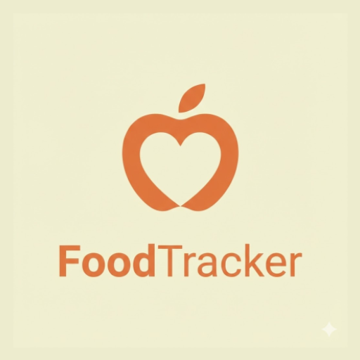
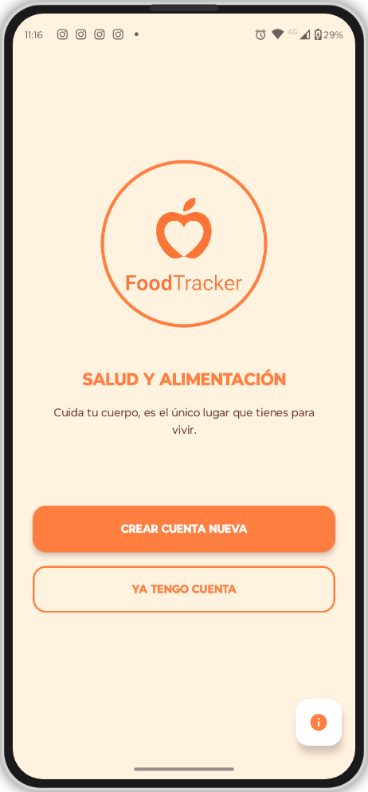
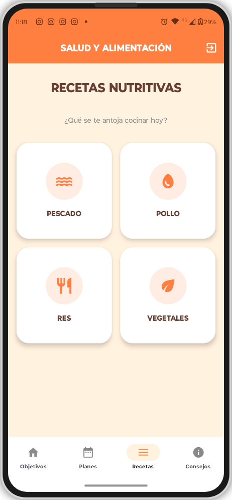
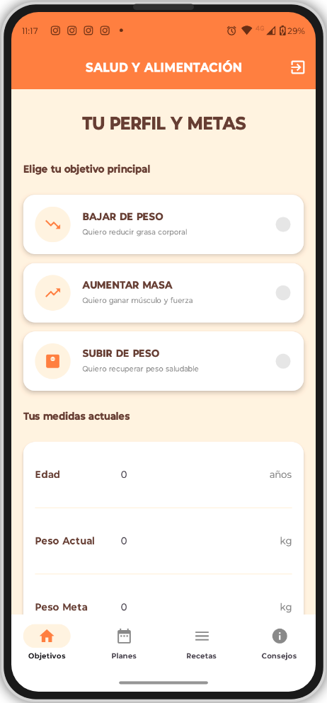
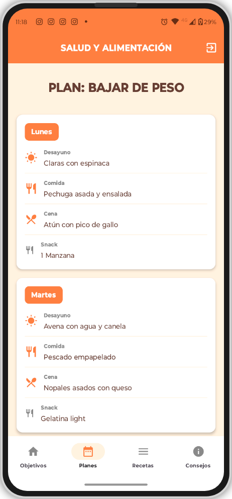

<div align="center">
    


# `>_` FoodTracker (NutriEdu)

**Aplicación Educativa de Salud y Nutrición. Tecnología móvil para combatir la obesidad y fomentar hábitos saludables.**

[](LICENSE)
[](https://developer.android.com/)
[](https://firebase.google.com/)
[](https://kotlinlang.org/)
[]()

<br>

| 🍎 | **Impacto Social:** | *Herramienta diseñada para estudiantes, enfocada en la prevención de enfermedades relacionadas con la mala alimentación.* |
|--|-------------|:-----------------------------------------------------------------------------------------------------------------------------------|

<br>
</div>

<p align="center">
    
</p>

---

<details>
    <summary>Desplegar Tabla de Contenidos</summary>
    
<br>
        
- [Propósito](#-propósito)
- [Galería de Pantallas](#-galería-de-pantallas)
- [Características](#-características)
- [Arquitectura y Stack](#-arquitectura-y-stack)
- [Metodología](#-metodología)
- [Instalación](#-instalación)
- [Créditos](#-créditos)

</details>

---

## `>_` Propósito

**FoodTracker** surge como respuesta a la problemática de los malos hábitos alimenticios en entornos estudiantiles, donde predomina el consumo de comida chatarra debido a la falta de tiempo y conocimiento.

Esta aplicación no es solo una calculadora; es una **herramienta educativa integral** que permite al usuario monitorear su estado de salud y aprender sobre nutrición de manera interactiva.

**Objetivos Clave:**
- **Concientización:** Informar sobre el valor nutricional de los alimentos.
- **Control:** Monitoreo del Índice de Masa Corporal (IMC).
- **Prevención:** Reducir riesgos de obesidad y enfermedades crónicas mediante la tecnología.

---

## `>_` 📱 Galería de Pantallas

Diseño intuitivo desarrollado en Android Studio con enfoque en la experiencia de usuario (UX) educativa.

<div align="center">
    <br>
    <table>
        <tr>
            <td align="center" width="25%">
                <strong>Acceso Seguro</strong><br>
                <em>Login con Firebase Auth.</em><br><br>
                
            </td>
            <td align="center" width="25%">
                <strong>Menú Principal</strong><br>
                <em>Navegación fluida.</em><br><br>
                
            </td>
            <td align="center" width="25%">
                <strong>Cálculo de IMC</strong><br>
                <em>Diagnóstico instantáneo.</em><br><br>
                
            </td>
            <td align="center" width="25%">
                <strong>Módulos Educativos</strong><br>
                <em>Información nutricional.</em><br><br>
                
            </td>
        </tr>
    </table>
    <br>
</div>

---

## `>_` Características

- **🔐 Autenticación en la Nube:** Sistema de Registro e Inicio de Sesión seguro gestionado por **Firebase**.
- **📊 Calculadora de IMC:** Algoritmo que determina el estado de peso (Bajo, Normal, Sobrepeso) basado en inputs del usuario.
- **🥗 Recomendaciones:** Tips personalizados según el resultado del IMC para mejorar la dieta.
- **📚 Contenido Educativo:** Módulos informativos sobre el "Plato del Buen Comer" y propiedades de los alimentos.
- **⚡ Interfaz Nativa:** Rendimiento fluido utilizando Kotlin y XML.

---

## `>_` Arquitectura y Stack

El desarrollo se fundamenta en tecnologías móviles modernas para garantizar escalabilidad y seguridad.

| Componente | Tecnología | Uso en el Proyecto |
| :--- | :--- | :--- |
| **Lenguaje** | **Kotlin** | Lógica de negocio y control de actividades. |
| **IDE** | **Android Studio** | Entorno de desarrollo integrado. |
| **Backend** | **Firebase** | Gestión de usuarios (Auth) y base de datos en tiempo real. |
| **UI/UX** | **XML** | Diseño de interfaces responsivas y accesibles. |

---

## `>_` Metodología

Para asegurar la calidad educativa y técnica, se implementó el modelo **ADDIE**:

1.  **Análisis:** Identificación de necesidades nutricionales en estudiantes.
2.  **Diseño:** Prototipado de interfaces y flujo de usuario.
3.  **Desarrollo:** Codificación en Kotlin e integración de servicios.
4.  **Implementación:** Despliegue y pruebas en dispositivos reales.
5.  **Evaluación:** Validación funcional y corrección de errores.

---

## `>_` Instalación

Si deseas clonar y ejecutar este proyecto educativo:

1.  Clonar el repositorio:
    ```bash
    git clone [https://github.com/DeathSilencer/FoodTracker-Health-Education.git](https://github.com/DeathSilencer/FoodTracker-Health-Education.git)
    ```
2.  Abrir en **Android Studio**.
3.  Conectar tu propio proyecto de **Firebase**:
    * Descarga tu `google-services.json`.
    * Colócalo en la carpeta `app/`.
4.  Sincronizar Gradle y ejecutar.

---

## `>_` Créditos

- 👨‍💻 **Desarrollador Principal:** David Platas
- 👥 **Equipo de Investigación:** Jesús Ramírez, Dayana Ortiz, Yara Díaz.
- 🎓 **Institución:** Universidad Politécnica del Valle de México.

<div align="center">
  <a href="https://github.com/DeathSilencer">
    
  </a>
</div>

<br>

### `>_` ⚖️ Disclaimer

> [!Warning]
> **Aviso de Salud:** <br>
> Esta aplicación proporciona recomendaciones generales basadas en el IMC. No sustituye el consejo médico profesional. Siempre consulta a un nutriólogo certificado para dietas específicas.
